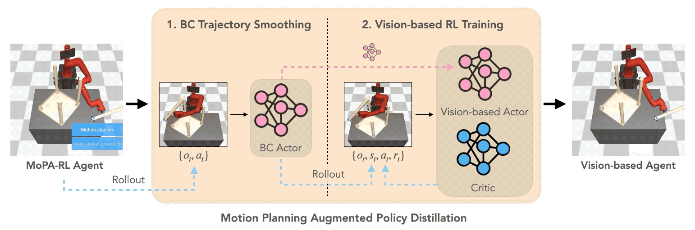
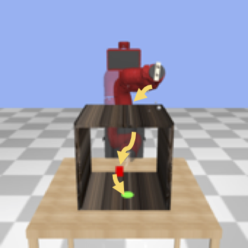
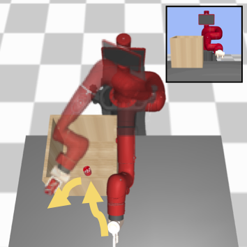
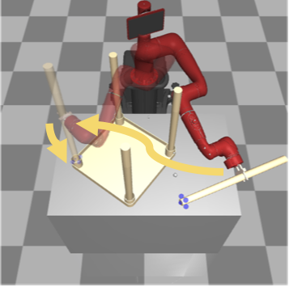

# Distilling Motion Planner Augmented Policies into Visual Control Policies for Robot Manipulation

[[Project website](https://clvrai.com/mopa-pd)] [[Paper](https://openreview.net/pdf?id=NZnz3cExrDW)]

This project is a PyTorch implementation of [Distilling Motion Planner Augmented Policies into Visual Control Policies for Robot Manipulation](https://clvrai.com/mopa-pd), published in CoRL 2021.

<p align="center">
    
</p>

Learning complex manipulation tasks in realistic, obstructed environments is a challenging problem due to hard exploration in the presence of obstacles and high-dimensional visual observations. Prior work tackles the exploration problem by integrating motion planning and reinforcement learning. However, the motion planner augmented policy requires access to state information, which is often not available in the real-world settings. To this end, we propose to distill the state-based motion planner augmented policy to a visual control policy via (1) visual behavioral cloning to remove the motion planner dependency along with its jittery motion, and (2) vision-based reinforcement learning with the guidance of the smoothed trajectories from the behavioral cloning agent. We validate our proposed approach on three manipulation tasks in obstructed environments and show its high sample-efficiency, outperforming state-of-the-art algorithms for visual policy learning.

## Prerequisites
- Ubuntu 18.04
- Python 3.7
- [MuJoCo 2.0](http://www.mujoco.org/)

## Installation
1. Install Mujoco 2.0 and add the following environment variables into `~/.bashrc` or `~/.zshrc`.
```
# Download mujoco 2.0
$ wget https://www.roboti.us/download/mujoco200_linux.zip -O mujoco.zip
$ unzip mujoco.zip -d ~/.mujoco
$ mv ~/.mujoco/mujoco200_linux ~/.mujoco/mujoco200

# Copy mujoco license key `mjkey.txt` to `~/.mujoco`

# Add mujoco to LD_LIBRARY_PATH
$ export LD_LIBRARY_PATH=$LD_LIBRARY_PATH:$HOME/.mujoco/mujoco200/bin

# For GPU rendering (replace 418 with your nvidia driver version)
$ export LD_LIBRARY_PATH=$LD_LIBRARY_PATH:/usr/lib/nvidia-418

# Only for a headless server
$ export LD_PRELOAD=/usr/lib/x86_64-linux-gnu/libGLEW.so:/usr/lib/nvidia-418/libGL.so
```

2. Download this repository and install python dependencies
```
# Install system packages
sudo apt-get install libgl1-mesa-dev libgl1-mesa-glx libosmesa6-dev patchelf libopenmpi-dev libglew-dev python3-pip python3-numpy python3-scipy

# Create out/ folder for saving/loading RL checkpoints
cd mopa-pd
mkdir out

# Create checkpoints/ folder for saving/loading BC-Visual checkpoints
mkdir checkpoints

# Install required python packages in your new env
pip install -r requirements.txt
```

3. Install ompl
```
# Linux
sudo apt install libyaml-cpp-dev
sh ./scripts/misc/installEigen.sh #from the home directory # install Eigen
sudo apt-get install libboost-all-dev # install Boost C++ for ompl

# Mac OS
brew install libyaml yaml-cpp
brew install eigen

# Build ompl
git clone git@github.com:ompl/ompl.git ../ompl
cd ../ompl
cmake .
sudo make install

# if ompl-x.x (x.x is the version) is installed in /usr/local/include, you need to rename it to ompl
mv /usr/local/include/ompl-x.x /usr/local/include/ompl
```

4. Build motion planner python wrapper
```
cd ./mopa-pd/motion_planners
python setup.py build_ext --inplace
```

5. Configure [wandb](http://wandb.ai/) for tracking experiments (optional)
  * Sign up for a free account at https://app.wandb.ai/login?signup=true.
  * Open this file: `config/__init__.py`
  * Set `wandb` argument to `True`.
  * Add your username to the `entity` argument.
  * Add your project name to the `project` argument.  

6. Servers without a monitor (optional)

You may use the following code to create a virtual monitor for rendering.

```
# Run the next line for Ubuntu
$ sudo apt-get install xserver-xorg libglu1-mesa-dev freeglut3-dev mesa-common-dev libxmu-dev libxi-dev

# Configure nvidia-x
$ sudo nvidia-xconfig -a --use-display-device=None --virtual=1280x1024

# Launch a virtual display
$ sudo /usr/bin/X :1 &

# Run a command with DISPLAY=:1
DISPLAY=:1 <command>
```

## Available environments

| SawyerPushObstacle-v0 | SawyerLiftObstacle-v0 | SawyerAssemblyObstacle-v0 |
| - | - | - |
|  |  |  |

## How to run experiments

Launch a virtual display (only for a headless server)
```
sudo /usr/bin/X :1 &
```
[MoPA-RL](https://github.com/clvrai/mopa-rl)
```
# train MoPA-RL policy
sh ./scripts/3d/assembly/mopa.sh 0 1234
sh ./scripts/3d/lift/mopa.sh 0 1234
sh ./scripts/3d/push/mopa.sh 0 1234

# evaluate MoPA-RL policy
sh ./scripts/3d/assembly/mopa_eval.sh 0 1234
sh ./scripts/3d/lift/mopa_eval.sh 0 1234
sh ./scripts/3d/push/mopa_eval.sh 0 1234

# generate MoPA-RL data for BC-Visual using trained MoPA-RL's checkpoint
sh ./scripts/3d/assembly/run_multiple_sh.sh
sh ./scripts/3d/lift/run_multiple_sh.sh
sh ./scripts/3d/push/run_multiple_sh.sh
```

BC-Visual
```
# pre-process MoPA-RL data
python util/state_img_preprocessing.py

cd rl # must be inside rl folder to execute the following commands

# bc_visual_args.py is the config for training and evaluating BC-Visual

# train BC-Visual 
python behavioral_cloning_visual.py

# evaluate BC-Visual
python evaluate_bc_visual.py
```

Baselines and Ours

* Before running the following training scripts, please download checkpoints from (https://www.dropbox.com/sh/g8c5gz0k63qx1hl/AAD8sh_lw-JrQPAm-UoHVBUfa?dl=0) and place them inside the `out/` folder.

- Sawyer Push
```
###### Training
sh ./scripts/3d/push/bcrl_stochastic_two_buffers.sh 0 1234 # Ours
sh ./scripts/3d/push/bcrl_stochastic_two_buffers_mopa.sh 0 1234 # Ours (w/o BC Smoothing)
sh ./scripts/3d/push/bcrl_stochastic_two_buffers_dr.sh 0 1234 # Ours (w DR)
sh ./scripts/3d/push/bcrl_mopa_sota.sh 0 1234 # CoL 
sh ./scripts/3d/push/bcrl_sota.sh 0 1234 # CoL (w BC Smoothing) 
sh ./scripts/3d/push/mopa_asym.sh 0 1234 # MoPA Asym. SAC
sh ./scripts/3d/push/bcrl_stochastic_randweights.sh 0 1234 # Asym. SAC

###### Evaluation
sh ./scripts/3d/push/bcrl_stochastic_two_buffers_eval.sh 0 1234 # Ours
sh ./scripts/3d/push/bcrl_stochastic_two_buffers_mopa_eval.sh 0 1234 # Ours (w/o BC Smoothing)
sh ./scripts/3d/push/bcrl_stochastic_two_buffers_dr_eval.sh 0 1234 # Ours (w DR)
sh ./scripts/3d/push/bcrl_mopa_sota_eval.sh 0 1234 # CoL
sh ./scripts/3d/push/bcrl_sota_eval.sh 0 1234 # CoL (w BC Smoothing)
sh ./scripts/3d/push/mopa_asym_eval.sh 0 1234  # MoPA Asym. SAC
sh ./scripts/3d/push/bcrl_stochastic_randweights_eval.sh 0 1234 # Asym. SAC
```

- Sawyer Lift
```
###### Training
sh ./scripts/3d/lift/bcrl_stochastic_two_buffers.sh 0 1234 # Ours
sh ./scripts/3d/lift/bcrl_stochastic_two_buffers_mopa.sh 0 1234 # Ours (w/o BC Smoothing)
sh ./scripts/3d/lift/bcrl_stochastic_two_buffers_dr.sh 0 1234 # Ours (w DR)
sh ./scripts/3d/lift/bcrl_mopa_sota.sh 0 1234 # CoL
sh ./scripts/3d/lift/bcrl_sota.sh 0 1234 # CoL (w BC Smoothing) 
sh ./scripts/3d/lift/mopa_asym.sh 0 1234 # MoPA Asym. SAC
sh ./scripts/3d/lift/bcrl_stochastic_randweights.sh 0 1234 # Asym. SAC

###### Evaluation
sh ./scripts/3d/lift/bcrl_stochastic_two_buffers_eval.sh 0 1234 # Ours
sh ./scripts/3d/lift/bcrl_stochastic_two_buffers_mopa_eval.sh 0 1234 # Ours (w/o BC Smoothing)
sh ./scripts/3d/lift/bcrl_stochastic_two_buffers_dr_eval.sh 0 1234 # Ours (w DR)
sh ./scripts/3d/lift/bcrl_mopa_sota_eval.sh 0 1234 # CoL
sh ./scripts/3d/lift/bcrl_sota_eval.sh 0 1234 # CoL (w BC Smoothing)
sh ./scripts/3d/lift/mopa_asym_eval.sh 0 1234 # MoPA Asym. SAC
sh ./scripts/3d/lift/bcrl_stochastic_randweights_eval.sh 0 1234 # Asym. SAC
```

- Sawyer Assembly
```
###### Training
sh ./scripts/3d/assembly/bcrl_stochastic_two_buffers.sh 0 1234 # Ours
sh ./scripts/3d/assembly/bcrl_stochastic_two_buffers_mopa.sh 0 1234 # Ours (w/o BC Smoothing)
sh ./scripts/3d/assembly/bcrl_stochastic_two_buffers_dr.sh 0 1234 # Ours (w DR)
sh ./scripts/3d/assembly/bcrl_mopa_sota.sh 0 1234 # CoL
sh ./scripts/3d/assembly/bcrl_sota.sh 0 1234 # CoL (w BC Smoothing)
sh ./scripts/3d/assembly/mopa_asym.sh 0 1234 # MoPA Asym. SAC
sh ./scripts/3d/assembly/bcrl_stochastic_randweights.sh 0 1234 # Asym. SAC

###### Evaluation
sh ./scripts/3d/assembly/bcrl_stochastic_two_buffers_eval.sh 0 1234 # Ours
sh ./scripts/3d/assembly/bcrl_stochastic_two_buffers_mopa_eval.sh 0 1234 # Ours (w/o BC Smoothing)
sh ./scripts/3d/assembly/bcrl_stochastic_two_buffers_dr_eval.sh 0 1234 # Ours (w DR)
sh ./scripts/3d/assembly/bcrl_mopa_sota_eval.sh 0 1234 # CoL
sh ./scripts/3d/assembly/bcrl_sota_eval.sh 0 1234 # CoL (w BC Smoothing) 
sh ./scripts/3d/assembly/mopa_asym_eval.sh 0 1234 # MoPA Asym. SAC
sh ./scripts/3d/assembly/bcrl_stochastic_randweights_eval.sh 0 1234 # Asym. SAC
```

### Domain Randomization
To run experiments with domain randomized simulation, the following parameters can be set in `config`:

- dr: set to `True` to train the model with domain randomization
- dr_params_set: choose as per the training environment - `["sawyer_push, sawyer_lift, sawyer_assembly]`
- dr_eval: set to `True` for evaluating the domain randomization model


## Directories
The structure of the repository:

- `rl`: Reinforcement learning code
- `env`: Environment code for simulated experiments (2D Push and all Sawyer tasks)
- `config`: Configuration files
- `util`: Utility code
- `motion_planners`: Motion planner code from MoPA-RL
- `scripts`: Scripts for all experiments

Log directories:

- `logs/rl.ENV.DATE.PREFIX.SEED`:
  - `cmd.sh`: A command used for running a job
  - `git.txt`: Log gitdiff
  - `prarms.json`: Summary of parameters
  - `video`: Generated evaulation videos (every evalute_interval)
  - `wandb`: Training summary of W&B, like tensorboard summary
  - `ckpt_*.pt`: Stored checkpoints (every ckpt_interval)
  - `replay_*.pt`: Stored replay buffers (every ckpt_interval)


## Trouble shooting

### Mujoco GPU rendering
To use GPU rendering for mujoco, you need to add `/usr/lib/nvidia-000` (`000` should be replaced with your NVIDIA driver version) to `LD_LIBRARY_PATH` before installing `mujoco-py`. Then, during `mujoco-py` compilation, it will show you `linuxgpuextension` instead of `linuxcpuextension`. In Ubuntu 18.04, you may encounter an GL-related error while building `mujoco-py`, open `venv/lib/python3.7/site-packages/mujoco_py/gl/eglshim.c` and comment line 5 `#include <GL/gl.h>` and line 7 `#include <GL/glext.h>`.

### Virtual display on headless machines
On servers, you don’t have a monitor. Use this to get a virtual monitor for rendering and put DISPLAY=:1 in front of a command.

```
# Run the next line for Ubuntu
$ sudo apt-get install xserver-xorg libglu1-mesa-dev freeglut3-dev mesa-common-dev libxmu-dev libxi-dev

# Configure nvidia-x
$ sudo nvidia-xconfig -a --use-display-device=None --virtual=1280x1024

# Launch a virtual display
$ sudo /usr/bin/X :1 &

# Run a command with DISPLAY=:1
DISPLAY=:1 <command>
```

### pybind11-dev not found
```
wget http://archive.ubuntu.com/ubuntu/pool/universe/p/pybind11/pybind11-dev_2.2.4-2_all.deb
sudo apt install ./pybind11-dev_2.2.4-2_all.deb
```

###  ERROR: GLEW initalization error: Missing GL version
This issue is most likely due to running on a headless server. 

Solution 1:
```
sudo mkdir -p /usr/lib/nvidia-000

Then add this line to ~/.bashrc file:
export LD_LIBRARY_PATH=$LD_LIBRARY_PATH:/usr/lib/nvidia-000
```

Solution 2:
```
1. First import and call mujocopy_render_hack in main.py
2. Follow the instructions in "Virtual display on headless machines" section
3. When running a script, remember to add DISPLAY:=1 <command> 
```

### /usr/bin/ld: cannot find -lGL

Source: https://stackoverflow.com/questions/33447653/usr-bin-ld-cannot-find-lgl-ubuntu-14-04
```
sudo rm /usr/lib/x86_64-linux-gnu/libGL.so 
sudo ln -s /usr/lib/libGL.so.1 /usr/lib/x86_64-linux-gnu/libGL.so 
```

## References
- This codebase is based on MoPA-RL: https://github.com/clvrai/mopa-rl
- PyTorch implementation of SAC: https://github.com/clvrai/coordination
- Sawyer MuJoCo environment: https://github.com/StanfordVL/robosuite
- Sawyer assets: https://github.com/vikashplus/sawyer_sim


## Citation
If you find this useful, please cite
```
@inproceedings{liu2021mopa,
  title={Distilling Motion Planner Augmented Policies into Visual Control Policies for Robot Manipulation},
  author={I-Chun Arthur Liu and Shagun Uppal and Gaurav S. Sukhatme and Joseph J. Lim and Peter Englert and Youngwoon Lee},
  booktitle={Conference on Robot Learning},
  year={2021}
}
```

## Authors
[I-Chun (Arthur) Liu](https://arthur801031.github.io/)\*, [Shagun Uppal](https://shagunuppal.github.io/)\*, [Gaurav S. Sukhatme](http://robotics.usc.edu/~gaurav), [Joseph J. Lim](https://viterbi-web.usc.edu/~limjj/), [Peter Englert](http://www.peter-englert.net/), and [Youngwoon Lee](https://youngwoon.github.io) at [USC CLVR](https://clvrai.com) and [USC RESL](https://robotics.usc.edu/resl/)
(\*Equal contribution)
