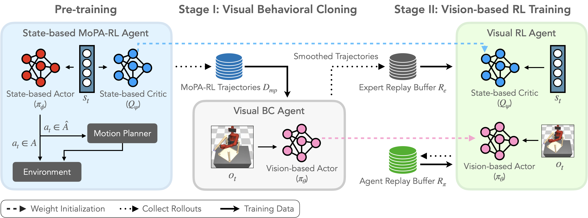
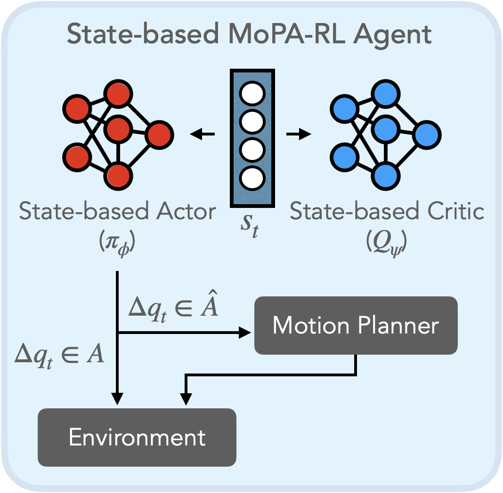
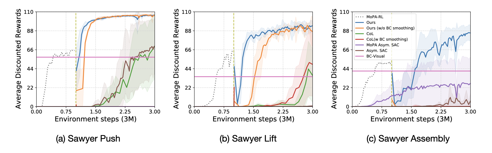

----

## Overview

<!--  -->

Our goal is to solve complex manipulation tasks in obstructed environments in the visual domain. We propose motion planner augmented policy distillation (<b>MoPA-PD</b>) that distills a motion planner-augmented state-based agent (MoPA-RL) to learn a visual policy, removing the planner and state dependency. Our method has two advantages: 
<ol>
<li>The learned policy no longer depends on a motion planner for planning collision-free paths. This makes the policy much faster as motion planner calls can be slow and computationally expensive in high-dimensional spaces.</li>
<li>The learned policy directly operates on environment images, not requiring state information and thus making it adequate for sim-to-sim and sim-to-real transfers.</li>
</ol>

## MoPA-RL

<div class="w3-row-padding">
	
</div>
MoPA-RL augments the action space of a RL agent with a motion planner. It decides direct action execution or motion planning based on the magnitude of the action proposed by the RL policy. If the predicted action at any time step is large, &#8710;<em>q</em><sub>t</sub>&isin;<em>A&#770;</em>, the robot is more likely to have collisions with obstacles in realizing that action. In this case, the motion planner is used to execute the large action in a collision-free manner. On the other hand, if the predicted action is small,  &#8710;<em>q</em><sub>t</sub>&isin;<em>A</em>, it is executed directly in the environment. As shown in <a href="https://clvrai.github.io/mopa-rl/" target="_blank">MoPA-RL</a>, this policy structure leads to a more efficient exploration of the state space by avoiding collision.

## MoPA-PD

<!-- <br>
<div class="w3-row-padding">
	
</div>
<br> -->

 

Our framework consists of two stages: (1) visual behavioral cloning (BC) with trajectories collected using the MoPA-RL policy and (2) BC trajectory-guided vision-based RL. The first step, visual BC, removes the dependency on the motion planner and the resulting policy generates smoother behaviors compared to the motion planner's jittery behaviors. In the second step, we learn an asymmetric visual policy with the guidance of smooth BC trajectories.
Precisely, our approach benefits from:
<ul>
<li><b>Weight initialization:</b> Leverages past experiences of the state-based agent and BC agent to improve sample-efficiency.</li>
<li><b>BC trajectory-guided RL:</b> Use BC smoothed paths instead of jittery MoPA-RL paths, to guide exploration and prevent catastrophic forgetting.</li>
<li><b>Entropy coefficient tuning (α):</b> Smaller α accelerates visual policy learning by exploiting state-based agent’s experiences rather than focusing on exploration from scratch.</li> 
</ul>

----

## Results

Our method solves each task in fewer steps than the baselines (MoPA-RL and Visual BC), thereby obtaining higher average discounted rewards. 
<br>

<span class="env-name"><b>Sawyer Push</b></span>
<ul>
<li>Sawyer arm is required to find a path to reach an object inside of a box, and push it to a goal position.</li>
<li>Our method (MoPA-PD) completes this task faster and with less jitter motion than the baselines (MoPA-RL and Visual BC).</li>
</ul>
<br>
<div class="w3-row-padding">
	<video height="auto" width="100%" controls autoplay loop muted>
		<source src="./video/Sawyer_Push.mp4" type="video/mp4">
	</video>
</div>
<span class="env-name"><b>Sawyer Lift</b></span>
<ul>
<li>Sawyer arm needs to find a path to get inside a box, grasp a can, and take it out from the box.</li>
<li>Our method demonstrates smooth and optimal behavior, while MoPA-RL exhibits jittery and sub-optimal movements, and Visual BC fails to complete this task.</li>
</ul>
<br>
<div class="w3-row-padding">
	<video height="auto" width="100%" controls autoplay loop muted>
		<source src="./video/Sawyer_Lift.mp4" type="video/mp4">
	</video>
</div>
<span class="env-name"><b>Sawyer Assembly</b></span>
<ul>
<li>Sawyer arm with an attached table leg needs to avoid other legs to reach a hole of the table, and insert the pole to assemble the table.</li>
<li>Our method completes this task the fastest and with the smoothest motions compared to the baselines.</li>
</ul>
<div class="w3-row-padding">
	<video height="auto" width="100%" controls autoplay loop muted>
		<source src="./video/Sawyer_Assembly.mp4" type="video/mp4">
	</video>
</div>

----

## Sim-to-Sim Transfer with Domain Randomization

<br>

For sim-to-sim transfer, we couple our method with domain randomization. Our visual policy is robust under transfer to unseen environments with additional distractor objects.  

<br>

<span class="env-name"><b>Sawyer Push</b></span>
<div class="w3-row-padding">
	<video height="auto" width="100%" controls autoplay loop muted>
		<source src="./video/Sawyer_Push_DT.mp4" type="video/mp4">
	</video>
</div>
<span class="env-name"><b>Sawyer Lift</b></span>
<div class="w3-row-padding">
	<video height="auto" width="100%" controls autoplay loop muted>
		<source src="./video/Sawyer_Lift_DT.mp4" type="video/mp4">
	</video>
</div>
<span class="env-name"><b>Sawyer Assembly</b></span>
<div class="w3-row-padding">
	<video height="auto" width="100%" controls autoplay loop muted>
		<source src="./video/Sawyer_Assembly_DT.mp4" type="video/mp4">
	</video>
</div>

----

## Quantitative Results

<div class="w3-row-padding">
    <p>Learning curves of our method compared to baselines. We train MoPA-RL for 1M env steps, followed by 2M steps for baselines requiring MoPA-RL pre-training (total 3M). Other baselines not requiring MoPA-RL are also trained for 3M steps for a fair comparison. Our method solves all the tasks with highest average discounted rewards.</p>
	
</div>

----

## Citation
```
@inproceedings{liu2021mopa,
  title={Distilling Motion Planner Augmented Policies into Visual Control Policies for Robot Manipulation},
  author={I-Chun Arthur Liu and Shagun Uppal and Gaurav S. Sukhatme and Joseph J. Lim and Peter Englert and Youngwoon Lee},
  booktitle={Conference on Robot Learning},
  year={2021}
}
```
<br>